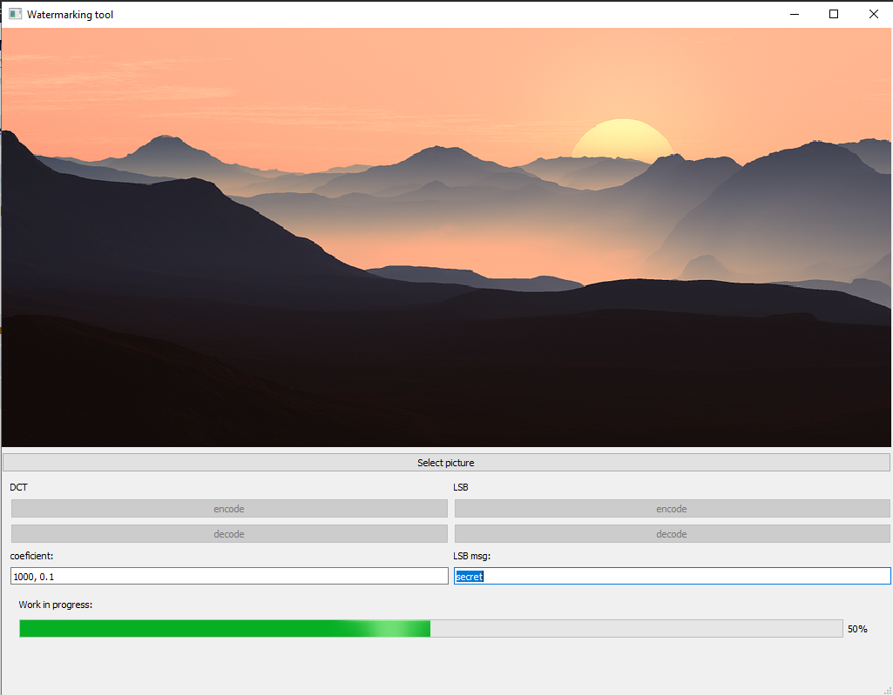

[](https://travis-ci.com/MMCVDigitalWatermarking/DigitalWatermarking)
# Digital Watermarking
***
## 0. Setup
```
$ python3 -m venv env
$ source env/bin/activate
$ pip install -r requirements.txt
```
***
## 1. Quickstart
To run application, type
```
python main.py
```
Application will be opened in new window.

### LSB encoding
1. select image to be watermarked
2. pass secret message to be encoded
3. pick LSB encode
4. by default, result will be saved as `result.png` in working directory
### LSB decoding
1. select image to decode hidden message
2. pick LSB decode
3. in case of image watermarked by LSB method, secret message will be displayed
### DCT encoding
1. select image to be watermarked
2. pass DCT coefficients (in X, Y format, where X regulates change in DCT coefficients and Y represents number of coefficients to be changed)
3. pick DCT encode
4. by default, result will be saved as `result_DCT.png` in working directory
### DCT decoding
1. select image to be checked for watermark presence
2. pick DCT decode
3. application will display the information, if image was watermarked by DCT method
